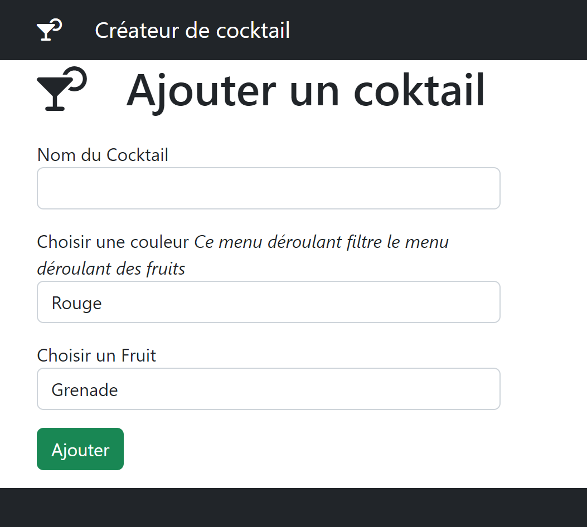
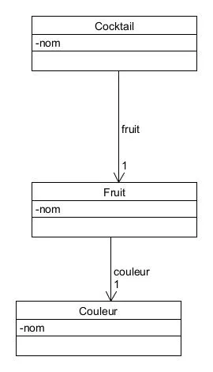

# Mise en place de requete Ajax avec Symfony

## Créer un route qui retourne du JSON
```php
 #[Route('/personne/liste2', name: 'personne_liste_2')]
    public function liste2(PersonneRepository $repo): Response
    {
           return $this->json($repo->findAll());
    }
```

## dans twig intérroger cette route

```html
<div id="demo">code ici</div>
<
<script>
async function go (){
let response = await fetch('http://127.0.0.1:8000/personne/liste2');
let users = await response.json();
console.log(users);
for (let u of users){
    let p = document.createElement('p');
    p.innerHTML = u.prenom; // <p>Bob<p>
    document.getElementById('demo').appendChild(p);
    console.log(u.prenom);
}
}
go();
</script>
```

## Bloquer circular reference
**#[Ignore]**

```php

namespace App\Entity;

use App\Repository\PersonneRepository;
use Doctrine\Common\Collections\ArrayCollection;
use Doctrine\Common\Collections\Collection;
use Doctrine\ORM\Mapping as ORM;
use Symfony\Component\Serializer\Annotation\Ignore;

#[ORM\Entity(repositoryClass: PersonneRepository::class)]

class Personne
{
    #[ORM\Id]
    #[ORM\GeneratedValue]
    #[ORM\Column]
    private ?int $id = null;

    #[ORM\Column(length: 255)]
    private ?string $prenom = null;

    #[ORM\Column(length: 255)]
    private ?string $nom = null;

    /**
     * @var Collection<int, Equipe>
     */
    #[Ignore]
    #[ORM\ManyToMany(targetEntity: Equipe::class, inversedBy: 'personnes')]
    private Collection $equipes;
```

## le Créateur de Coktail
  
  
   
Créer 3 Entity  
- **Cocktail**  
  - nom
  - fruit
    
- **Fruit**  
  - nom
  - couleur  

- **Couleur**
  - nom    


  
### Objectif
- Ajouter le menu deroulant des couleurs
Afin de filtrer le menu déroulant des fruits

- Créer une requete Ajax pour récupérer le tableau de fruits avec sa couleur
- Lorsque je selectionne une couleur 
Reconstruire le menu deroulant des fruits en JavaScript


# mise en place des fixure

https://symfony.com/bundles/DoctrineFixturesBundle/current/index.html  
**installer la recette**
```
composer require --dev doctrine/doctrine-fixtures-bundle
```

**Purger la data base et charger les fixtures**
```
symfony console d:f:l   
```
```php
<?php
namespace App\DataFixtures;

use App\Entity\Cocktail;
use App\Entity\Couleur;
use App\Entity\Fruit;
use Doctrine\Bundle\FixturesBundle\Fixture;
use Doctrine\Persistence\ObjectManager;

class AppFixtures extends Fixture
{
    public function load(ObjectManager $manager)
    {
        $vert = new Couleur();
        $vert->setNom('vert');
        $manager->persist($vert);
        $rouge = new Couleur();
        $rouge->setNom('rouge');
        $manager->persist($rouge);
        //--------------------------
        $grenade = new Fruit();
        $grenade->setNom('grenade');
        $grenade->setCouleur($rouge);
        $manager->persist($grenade);

        $cerise = new Fruit();
        $cerise->setNom('cerise');
        $cerise->setCouleur($rouge); 
        $manager->persist($cerise);

        $kiwi = new Fruit();
        $kiwi->setNom('kiwi');
        $kiwi->setCouleur($vert); 
        $manager->persist($kiwi);

        $pomme = new Fruit();
        $pomme->setNom('pomme');
        $pomme->setCouleur($vert);
        $manager->persist($pomme); 
        //--------------------------

        $grenadine = New Cocktail();
        $grenadine->setNom('Grenadine Coktail');
        $grenadine->setFruit($grenade);
        $manager->persist($grenadine);

        $jus = New Cocktail();
        $jus->setNom('Cocktail jus de pomme');
        $jus->setFruit($pomme);
        $manager->persist($jus);;
            
        
      


      

        $manager->flush();
    }
}
```