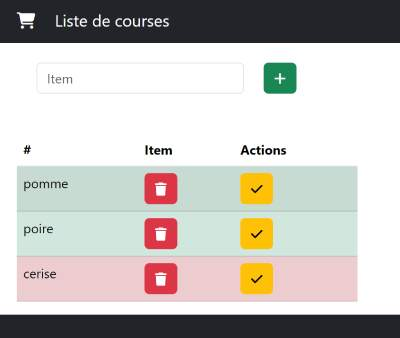

# Correction liste de courses



# Partie Back end : symfony
ENTITY Item :
- nom (string)  
- isBuy (boolean)

## méthode : POST ajouter un item
```php
#[Route('/api/item', name: 'api_post_item', methods: ['POST'])]
    public function ajouter(Request $request,EntityManagerInterface $em,SerializerInterface $serializer): Response
    {      
        $item = $serializer->deserialize($request->getContent(), Item::class, 'json');
        $item->setBuy(false);
        $em->persist($item);
        $em->flush();
        return $this->json($item); // avec id = renseigner
    }
```
## méthode : GET afficher les liste des items
```php
 #[Route('/api/item', name: 'api_get_item', methods: ['GET'])]
    public function afficher(ItemRepository $repo): Response
    {
        return $this->json($repo->findAll());
    }
```

## méthode : PATCH modifier un item
```php
  #[Route('/api/item/{id}', name: 'api_patch_film', methods: ['PATCH'])]
    public function modifier(Item $item,EntityManagerInterface $em): Response
    {
        $item->setBuy(!$item->isBuy());
        $em->flush();
        return $this->json($item);
        
    }
```

## méthode : DELETE supprimer un item
```php
#[Route('/api/item/{id}', name: 'api_delete_film', methods: ['DELETE'])]
public function enlever(Item $item,EntityManagerInterface $em): Response
{
    $em->remove($item);
    $em->flush();
    return $this->json($item);
}
```

# Partie front : react

## utiliser useEffect pour charger les items
```jsx
 const url = "http://localhost:8000/api/item";
  const [items, setItems] = useState([]);
  const loadData = async () => {
    const response = await axios.get(url);
    console.log(response.data);
    setItems(response.data);
  };
  useEffect(() => {
     loadData();
  }, []); //[] excuté 1 fois au demarrage
```
**Afficher dans la vue**
```jsx
 <tbody>
    {items &&
        items.map((item, i) => (
        <TrLigne key={i} 
        item={item} indice={i} 
        modifier={modifier} enlever={enlever}/>
        ))}
</tbody>
```

**Le component TrLigne**
```jsx
export default function TrLigne({ item,modifier,enlever,indice }) {
  return (
    <tr className={`table-${  item.buy ? 'danger':'success'}`}>
      <td>{item.nom}</td>
      <td>
        <button className="btn btn-danger" onClick={()=> enlever(indice)}>
          <i className="fa fa-trash"></i>
        </button>
      </td>
      <td>
        <button className="btn btn-warning" onClick={()=> modifier(indice)}>
          <i className="fa fa-check"></i>
        </button>
      </td>
    </tr>
  );
}
```

## ajouter un item
```jsx
 const ajouter = async (e) => {
    e.preventDefault(); //je bloque l envoie du formulaire
    const nom = e.target.nom.value;
    const item = {}; // créer un objet
    item.nom = nom;
    const response = await axios.post(url, item);
    const newItem = response.data;
    items.push(newItem);
    setItems([...items]);
    e.target.reset();
  }
```
** la vue**
```jsx
        <form method="post" onSubmit={ajouter}>
          <div className="row">
            <div className="col-8">
              <div className="bg-gris p-4">
                <div className="row">
                  <div className="col-4">
                    <input type="text" name="nom" className="form-control" placeholder="Item" />
                  </div>

                  <div className="col-1">
                    <button type="submit" className="btn btn-success">
                      <i className="fa fa-plus"></i>
                    </button>
                  </div>
                </div>
              </div>
            </div>
          </div>
        </form>
```

## modifier un item
```jsx
 const modifier = async (indice) => {
    const response = await axios.patch(`${url}/${items[indice].id}`);
    items[indice] = response.data;
    console.log(response.data);
    setItems([...items]);
  }
```

## enlever un item
```jsx
const enlever = async (indice) => {
    const response = await axios.delete(`${url}/${items[indice].id}`);
    items.splice(indice,1);
    setItems([...items]);
  }
```

## le fichier complet App.jsx
```jsx
import axios from "axios";
import { useEffect, useState } from "react";
import TrLigne from "./components/TrLigne.jsx";

export default function App() {
  const url = "http://localhost:8000/api/item";
  const [items, setItems] = useState([]);
  const loadData = async () => {
    const response = await axios.get(url);
    console.log(response.data);
    setItems(response.data);
  };
  useEffect(() => {
     loadData();
  }, []); //[] excuté 1 fois au demarrage
  const modifier = async (indice) => {
    const response = await axios.patch(`${url}/${items[indice].id}`);
    items[indice] = response.data;
    console.log(response.data);
    setItems([...items]);
  }
  const enlever = async (indice) => {
    const response = await axios.delete(`${url}/${items[indice].id}`);
    items.splice(indice,1);
    setItems([...items]);
  }
  const ajouter = async (e) => {
    e.preventDefault(); //je bloque l envoie du formulaire
    const nom = e.target.nom.value;
    const item = {}; // créer un objet
    item.nom = nom;
    const response = await axios.post(url, item);
    const newItem = response.data;
    items.push(newItem);
    setItems([...items]);
    e.target.reset();
  };

  return (
    <>
      <nav className="navbar navbar-expand-lg navbar-dark bg-dark">
        <div className="container">
          <a className="navbar-brand" href="#">
            <i className="fa-solid fa-cart-shopping me-4"></i>
            Liste de courses
          </a>
        </div>
      </nav>
      <div className="container">
        <form method="post" onSubmit={ajouter}>
          <div className="row">
            <div className="col-8">
              <div className="bg-gris p-4">
                <div className="row">
                  <div className="col-4">
                    <input type="text" name="nom" className="form-control" placeholder="Item" />
                  </div>

                  <div className="col-1">
                    <button type="submit" className="btn btn-success">
                      <i className="fa fa-plus"></i>
                    </button>
                  </div>
                </div>
              </div>
            </div>
          </div>
        </form>
        <div className="row">
          <div className="col-4">
            <table className="table table-striped mt-4">
              <thead>
                <tr>
                  <th>#</th>
                  <th>Item</th>

                  <th colSpan="2">Actions</th>
                </tr>
              </thead>
              <tbody>
                {items &&
                  items.map((item, i) => (
                    <TrLigne key={i} item={item} indice={i} modifier={modifier} enlever={enlever}/>
                  ))}
              </tbody>
            </table>
          </div>
        </div>
      </div>
      <footer className="py-5 bg-dark">
        <div className="container px-4 px-lg-5">
          <p className="m-0 text-center text-white">
            Copyright &copy; Seven Valley 2023
          </p>
        </div>
      </footer>
      
    </>
  );
}
```

